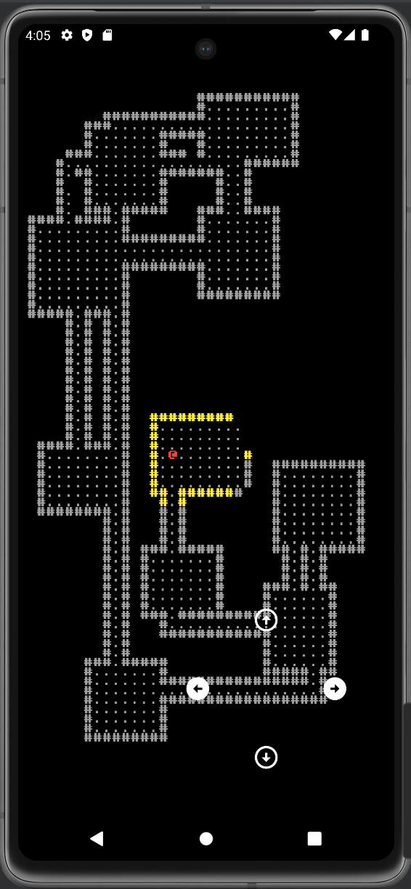

# Roguelike in Flutter

### Every year, the community over at - [r/roguelikedev](https://www.reddit.com/r/roguelikedev/new/) runs a "Tutorial Tuesday" series 
### that encourages new programmers to dive into the world of roguelike development.

### Many different programming languages are typically represented.
### I decided to try my hand at implementing a roguelike using - [Flutter](https://flutter.dev/)

<p align="center">
    
</p>

## How to run

First, you'll need to clone the repository using the following command in your terminal:

```sh
git clone https://github.com/mrlanu/flutter_roguelike.git
```

Then, you'll need to start the mobile app by running the following command in the project folder:

```sh
flutter run
```
